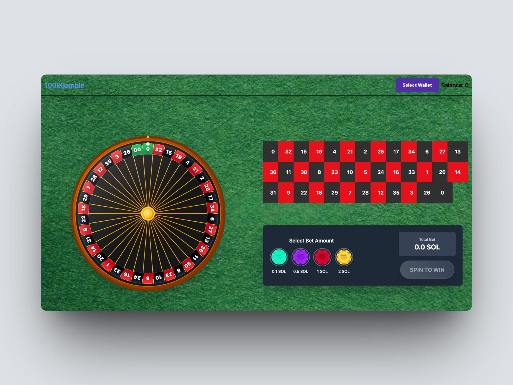
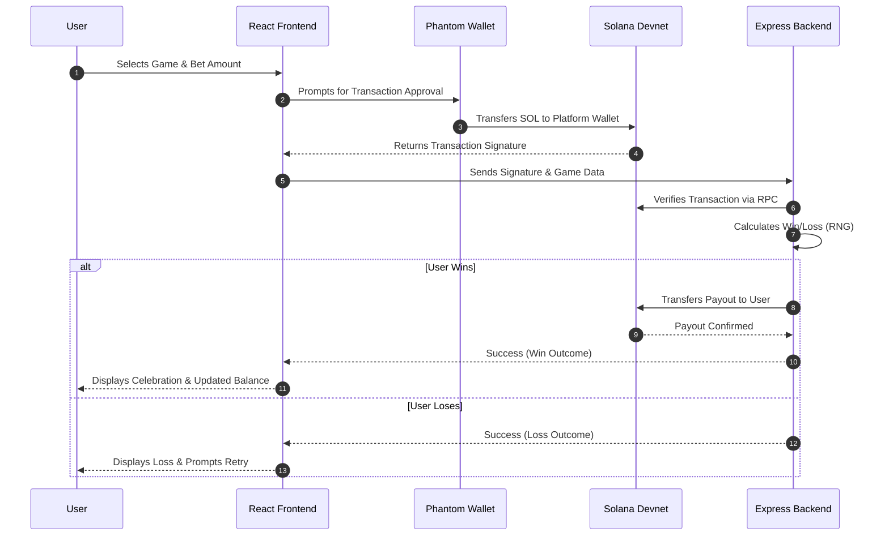

<div align="center">
  

  # Spin Gamble (100xGamble)

  **A Decentralized Web3 Casino built on Solana**

  [](https://solana.com/)
  [](https://reactjs.org/)
  [](https://www.typescriptlang.org/)
  [](https://expressjs.com/)

  [Features](#features) • [Architecture](#architecture) • [Getting Started](#getting-started) • [Tech Stack](#tech-stack) • [Disclaimer](#disclaimer)
</div>

## Overview

Spin Gamble is a decentralized gambling platform where users can connect their Phantom wallet and play classic casino-style games using SOL. Leveraging the high throughput and low fees of the Solana blockchain, the platform ensures verifiable, on-chain transactions and instant payouts.

---

## Features

- **Coin Flip:** A fast-paced 50/50 game. Choose your bet size, flip the coin, and instantly receive a 2x payout if you win.
- **Roulette:** A classic roulette experience featuring an animated wheel. Pick your lucky number, spin, and hit a jackpot payout.
- **Seamless Wallet Integration:** Native integration with Phantom and other Solana wallets using `@solana/wallet-adapter`.
- **Instant On-Chain Settlements:** All bets and payouts are verified and settled on the Solana devnet in seconds.

---

## Architecture & Flow

The system relies on a two-part architecture: a React frontend that handles UI and wallet interactions, and an Express backend that securely verifies transactions and processes payouts.



---

## Getting Started

### Prerequisites

- [Node.js](https://nodejs.org/) (v18+)
- [pnpm](https://pnpm.io/)
- A [Phantom Wallet](https://phantom.app/) extension
- Devnet SOL (obtainable from the [Solana Faucet](https://faucet.solana.com/))

### 1. Backend Setup

Navigate to the backend directory, install dependencies, and configure your environment variables.

```bash
cd backend
pnpm install
```

Create a `.env` file in the `backend` directory:
```env
PLATFORM_PUBLIC_KEY=<your-platform-wallet-public-key>
PLATFORM_PRIVATE_KEY=<your-platform-wallet-private-key-base58>
```

Start the backend server:
```bash
pnpm dev
```
> **Note:** The Express server will run on `http://localhost:3000`.

### 2. Frontend Setup

In a new terminal, navigate to the `wallet-adapter` directory to launch the React frontend.

```bash
cd wallet-adapter
pnpm install
pnpm dev
```
> **Note:** The Vite development server will open on `http://localhost:5173`.

---

## Tech Stack

### Frontend (`/wallet-adapter`)
- **Framework:** React 19 + TypeScript + Vite
- **Styling:** Tailwind CSS v4
- **Animations:** Framer Motion
- **Web3:** `@solana/wallet-adapter`, `@solana/web3.js`
- **State Management:** Jotai
- **Routing:** React Router DOM

### Backend (`/backend`)
- **Server:** Node.js + Express 5
- **Language:** TypeScript
- **Web3:** `@solana/web3.js` (Transaction Verification & Payouts)
- **HTTP Client:** Axios (RPC Interaction)

---

## Project Structure

```text
spin-gamble/
├── backend/                  # Node.js + Express server for game logic & payouts
│   ├── src/
│   │   ├── index.ts          # API Endpoints (/flip, /roulette) & Transaction processing
│   │   └── config/utils.ts   # Platform wallet configuration
│   └── package.json
└── wallet-adapter/           # React frontend built with Vite
    ├── src/
    │   ├── components/       # Reusable UI (Nav, Roulette Wheel, etc.)
    │   ├── pages/            # Views (Landing, CoinFlip, Roulette)
    │   ├── store/            # Jotai state atoms
    │   ├── App.tsx           # WalletProviders & Routing setup
    │   └── main.tsx
    └── package.json
```

---

## Disclaimer

This project is built strictly for **educational and learning purposes** and operates exclusively on the **Solana Devnet**. It is **not** intended for real-money gambling. Always gamble responsibly and adhere to local laws and regulations regarding online gambling.
